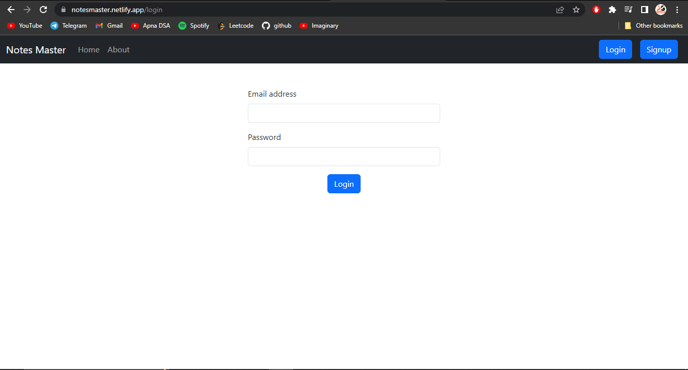

# Notes Master

Notes Master is a tool to save your all personal notes on the cloud on the go with multiple user login system.


## Authors

- [@Adinath Shelke](https://github.com/adi-shelke)


## Login Page



## Signup Page


## Dashboard Page


## Edit note modal


## Run Locally

Clone the project

```bash
  git clone https://github.com/adi-shelke/inotebook-frontend.git
```

Go to the project directory

```bash
  cd my-project
```

Install dependencies

```bash
  npm install
```

Start the server

```bash
  npm run start
```


## Features

- Used MongoDB atlas as database
- Single page application
- Adds, removes, updates notes in realtime
- Multiple user access mechanism


# Hi, I'm Adi! 👋

I am an IT student having a good knowledge of Web Technologies with experience of more than 2 years. I work on various web based projects, mainly on MERN stack.
## 🔗 Links

[](https://www.linkedin.com/in/adinath-shelke-2519b4203)
[](https://instagram.com/adi_shelke_07)

